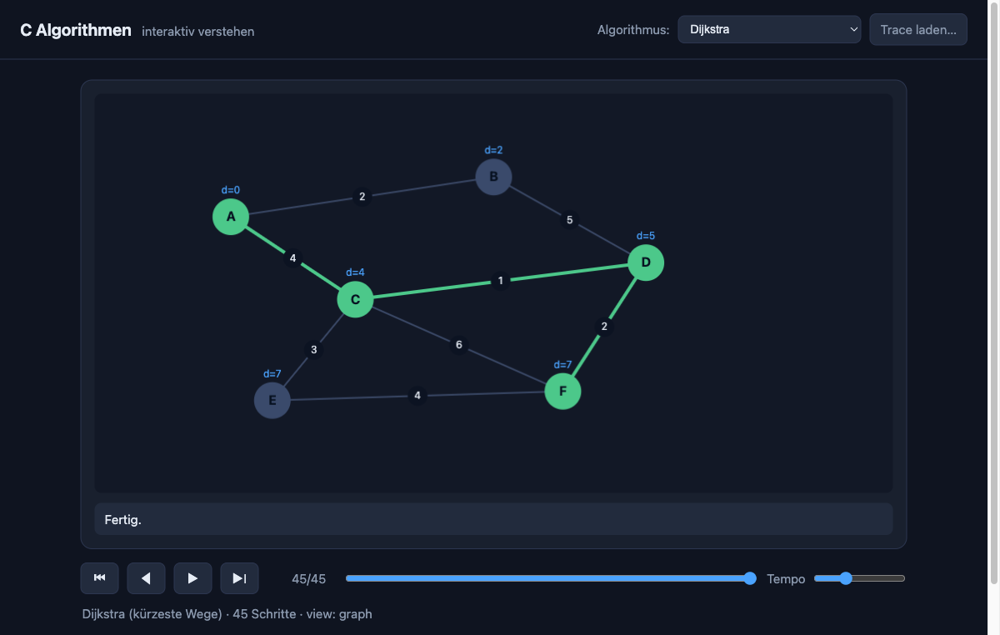
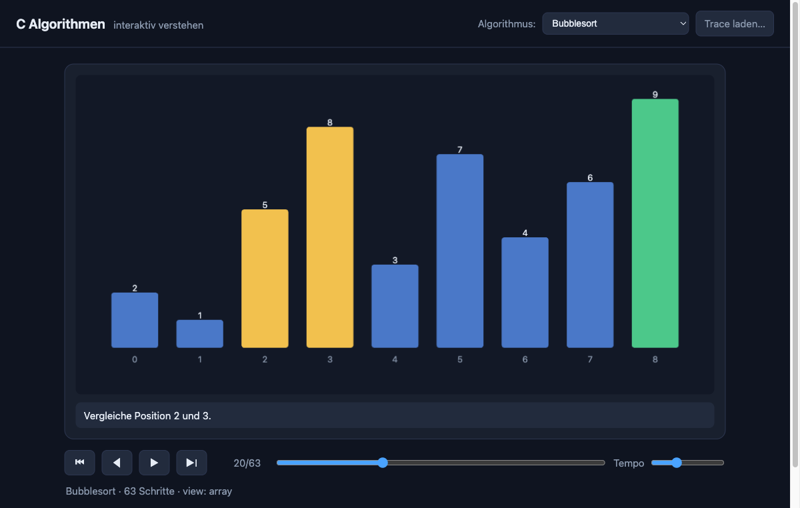

# C Algorithmen — interaktiv verstehen

Eine Lernsammlung klassischer Algorithmen in C (Stand 2026, macOS). Jeder
Algorithmus ist ein eigenständiges, kommentiertes C-Programm und kann zusätzlich
einen **Trace** schreiben, den ein interaktiver **Web-Player** Schritt für
Schritt animiert — zum Verstehen, nicht nur zum Nachschlagen.



## Idee

> Die C-Programme sind die **Quelle der Wahrheit**. Mit `--trace <datei>`
> schreiben sie ihren Ablauf als JSON; ohne das Flag laufen sie als ganz
> normale Terminal-Programme. Ein generischer Web-Player spielt die Traces ab.

Kein WebAssembly, kein Build-Schritt fürs Frontend — nur `clang`, `make` und ein
einfacher Python-Webserver, die auf macOS bereits vorhanden sind.

## Voraussetzungen

- **macOS** mit Xcode Command Line Tools (`clang`, `make`) — `xcode-select --install`
- **Python 3** für den lokalen Webserver (vorinstalliert)
- ein moderner Browser

## Schnellstart

```sh
make                 # alle Programme nach build/ bauen
make traces          # alle Demo-Traces nach web/traces/ erzeugen
make web             # Player unter http://localhost:8000/web/ servieren
```

Einzelnes Programm bauen und im Terminal ausführen:

```sh
make run NAME=algorithmen/sortieren/quicksort
```

Einen Trace gezielt neu erzeugen:

```sh
make trace NAME=algorithmen/sortieren/quicksort OUT=web/traces/quicksort.json
```

Ein Programm automatisch debuggen — läuft nicht-interaktiv unter `lldb`; bei
einem Absturz (Segfault/Assert) gibt es selbsttätig einen Backtrace mit
Datei:Zeile aus, sonst die normale Ausgabe:

```sh
make debug NAME=algorithmen/sortieren/quicksort
make debug NAME=algorithmen/sortieren/quicksort ARGS='--trace /tmp/t.json'
```

## Web-Player

`make web` starten, dann <http://localhost:8000/web/> öffnen (der Webserver ist
nötig — direktes Öffnen per `file://` blockiert das Laden der Traces). Oben den
Algorithmus wählen.

- **▶ / ⏸** abspielen / pausieren · **◀ ▶❘** Schritt zurück/vor · **⏮** zum Anfang
- **Timeline** an beliebige Stelle springen · **Tempo** Schritte pro Sekunde
- Tastatur: **Leertaste** play/pause, **←/→** Einzelschritt
- „Trace laden…" zeigt einen selbst erzeugten Trace direkt an



## Enthaltene Algorithmen

| Thema | Algorithmen |
|-------|-------------|
| Sortieren | Bubble-, Insertion-, Selection-, Quick-, Merge-, Heapsort |
| Suchen | lineare Suche, binäre Suche |
| Datenstrukturen | verkettete Liste, Stack, Queue, binärer Suchbaum, Hashtabelle |
| Graphen | Breitensuche (BFS), Tiefensuche (DFS), Dijkstra |
| Rekursion | Fibonacci-Aufrufbaum, Türme von Hanoi |
| Strings | Umkehren, Palindrom-Prüfung, naive Textsuche |
| Mathematik | Sieb des Eratosthenes, Primzahltest, ggT (Euklid) |
| Dynamische Programmierung | Fibonacci-Tabelle, 0/1-Rucksack |
| Grundlagen (visualisiert) | Bitoperationen (UND/ODER/XOR/Einerkomplement/Verschiebung), Logik-Wahrheitstabelle, Lotto 6 aus 49, Schaltung |

Die Visualisierung wählt anhand der Sicht (`view`) im Trace einen Renderer:
`array` (Balken bzw. Buchstaben), `tree` (Baum/Liste/Stack/Queue/Hash), `graph`,
`bits` (Bit-Reihen), `logik` (Wahrheitstabelle), `lotto` (Zahlengitter) und
`schaltung` (Schaltbild). Das Trace-Format ist in
[docs/trace-schema.md](docs/trace-schema.md) beschrieben; neue Algorithmen, die
eine vorhandene Sicht nutzen, brauchen keine Frontend-Änderung.

## Tests

Zwei lokal aufrufbare Test-Kategorien, die auch in der CI laufen:

```sh
make test        # Logik: assert-basierte Unit-Tests (tests/unit/) — Exit≠0 bei Fehler
make memcheck    # Speicher: alle Programme + Tests unter ASan/UBSan (LSan nur Linux)
```

- **Logik** — `tests/unit/*.c` sind eigenständige assert-Programme für die
  `lib/`-API (`meineFkt`-Arithmetik, `trace`-Lebenszyklus). Die Algorithmen in
  `src/` selbst sind bewusst self-contained (lokale/`static`-Logik) und werden
  über ihre Terminal-Ausgabe gegen eingecheckte Referenzen geprüft
  (`tools/check-golden.sh`).
- **Speicher** — `tools/check-memory.sh` baut jedes Programm und jeden Unit-Test
  mit Address-/UndefinedBehavior-Sanitizer und führt es aus (Demos auch mit
  `--trace`). Lecks (LeakSanitizer) werden nur unter Linux erkannt; auf macOS
  greifen lokal ASan/UBSan, die Leak-Prüfung übernimmt die CI.

Weitere Gates: `tools/check-hygiene.sh` (Konventionen), `tools/check-traces.py`
(Trace-Schema), ESLint + Playwright fürs Frontend (`npm run lint`,
`npm run test:e2e`).

## Projektstruktur

```
.
├── Makefile            portabler Auto-Discovery-Build (clang, build/)
├── lib/                meineFkt (Helfer) + trace (JSON-Trace-Bibliothek)
├── src/
│   ├── algorithmen/    die Algorithmen-Sammlung (thematisch gruppiert)
│   └── grundlagen/     ältere C-Lernbeispiele (Bitoperationen, Logik …)
├── web/                interaktiver Player (HTML/CSS/JS) + traces/
├── tests/              golden/ (Terminal-Ausgaben), unit/ (C-Unit-Tests), e2e/ (Player)
├── tools/              gen-traces.sh, debug.sh, check-{golden,traces,hygiene,memory}.sh
└── docs/               Trace-Schema, Tabellen, Bilder
```

## Grundlagen-Beispiele

Unter `src/grundlagen/` liegen die ursprünglichen Lernprogramme: bitweise
Operatoren, Logik-/Zahlensystem-Tabellen, Eingabeprüfung u. a. Sie werden vom
selben `make all` gebaut. Mehrere davon sind ebenfalls interaktiv visualisiert
(Bitoperationen, Logik, Lotto, Schaltung — siehe Tabelle oben); die übrigen
(z. B. Hallo-Welt, Eingabeprüfung) laufen nur im Terminal.

## Eigene Algorithmen hinzufügen

1. C-Datei unter `src/algorithmen/<thema>/` anlegen, `#include "trace.h"`.
2. `trace_init(argc, argv)`, dann `trace_begin(...)`, eine `trace_init_*`-Funktion
   und die passenden `trace_*`-Events einstreuen (siehe vorhandene Beispiele).
3. In `tools/gen-traces.sh` eine `run`-Zeile ergänzen.
4. `make traces && make web`.
